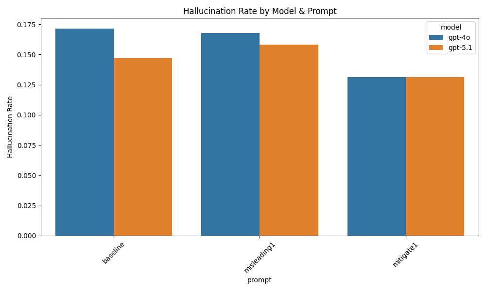

# Mini Research Project — Multimodal Hallucination

This project studies **object hallucination** in multimodal LLMs (GPT-4o and GPT-5.1).  
Models are asked yes/no questions about whether an object exists in an image.

We compare three prompt types:
- **Baseline**
- **Misleading** — increases hallucination
- **Mitigation** — reduces hallucination

## Hallucination Rate

## Key Findings
- Misleading prompts **increase** hallucination.
- Mitigation prompts **reduce** hallucination.
- GPT-5.1 hallucinates slightly less than GPT-4o.

This project demonstrates how **prompt design directly affects hallucination** in modern vision-language models.